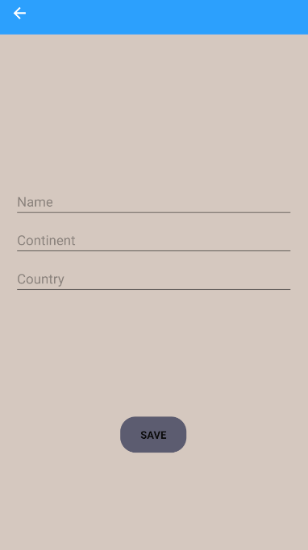
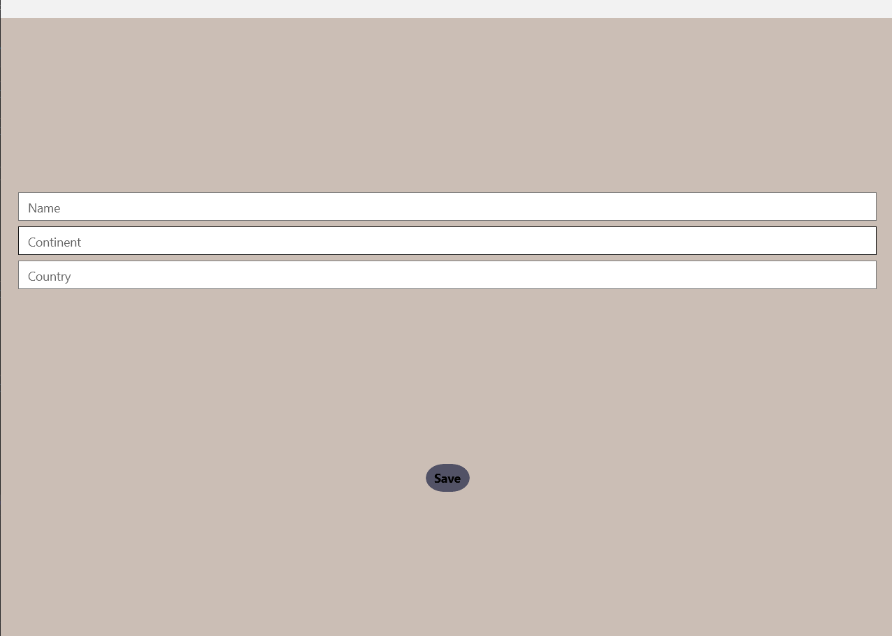

# Travel App
This project is a sample integration of an SQLite database into a Xamarin Forms app.
App allows users to enter the name of the city visited, country, and continent. Each entry is displayed in a ListView. Each entry is preserved in the database and can be deleted by user interaction (hold on Android, tap on UWP).
## Technologies Used
C#, Xamarin Forms, SQLite  
NuGet package used to work with SQLite: [sqlite-net-pcl](https://www.nuget.org/packages/sqlite-net-pcl?WT.mc_id=friends-0000-jamont)

## Layout
Android:

 

UWP:

 

IOS:

Not tested due to the lack of a physical device.
